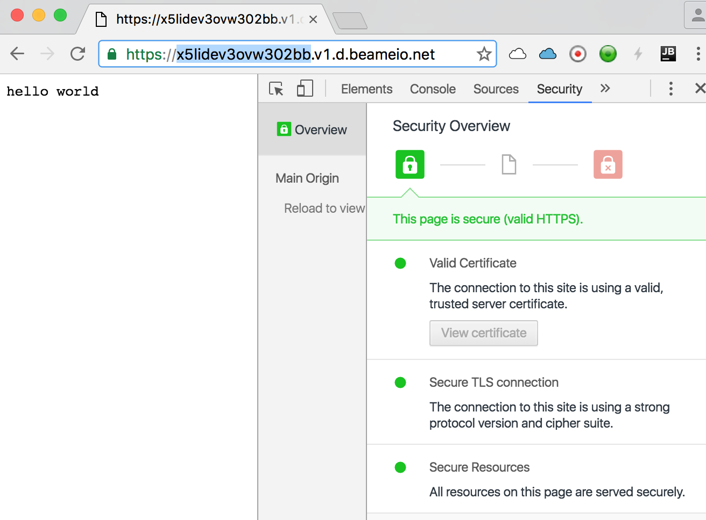
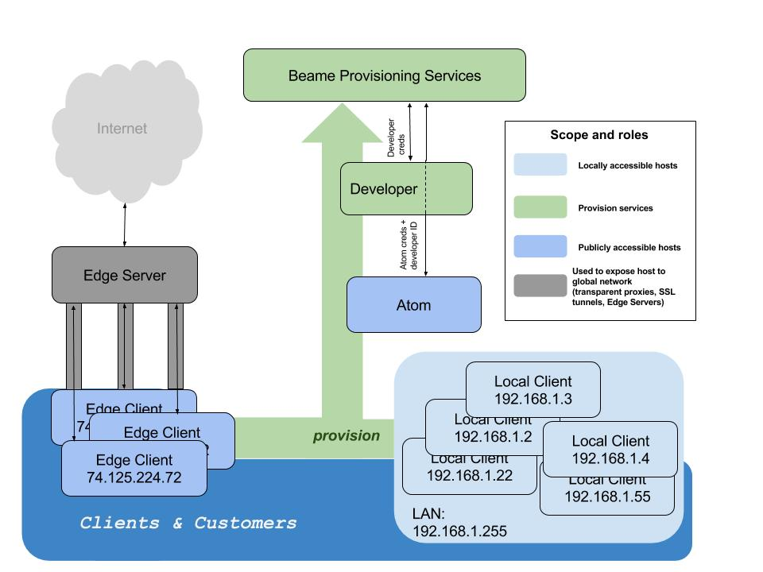
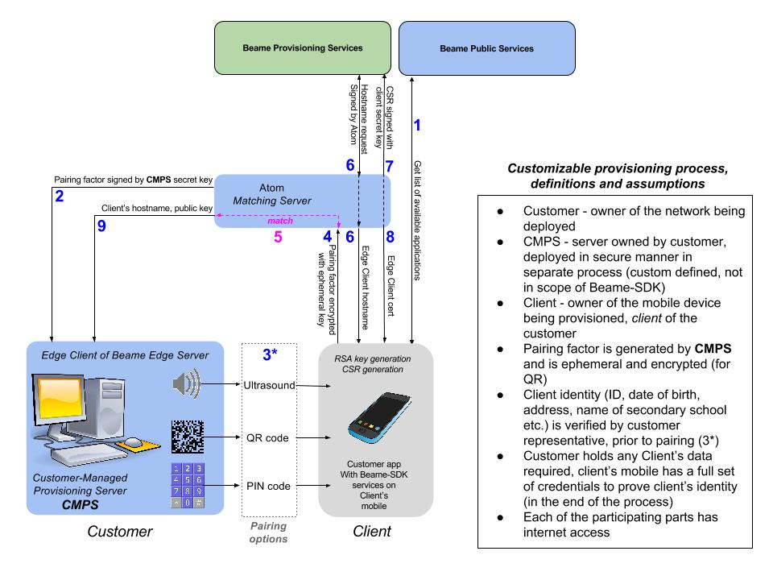
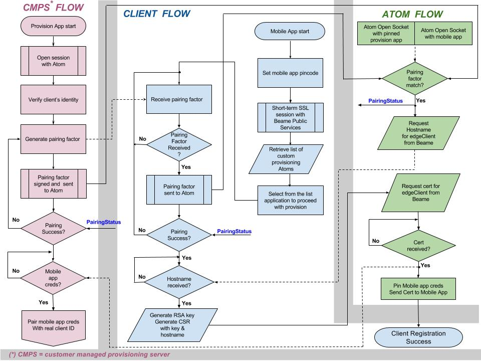

_The Beame SDK allows you to establish a HTTPS session between machines without public IPs. This SDK  allows you to create credentials and use them to identify machines. It’s a simple way to use encryption-based identity in web and mobile applications. This transparent security infrastructure can be used in any network, global or local, to create credentials, bind them to users’ hardware, and get strong, crypto-based authentication. This mitigates risk for services that host credentials to require users to prove identity._  
[Click to Get Started Now!](https://ypxf72akb6onjvrq.ohkv8odznwh5jpwm.v1.p.beameio.net/)  


### Table of Contents
 - [Beame SDK Networking basics](#beame-sdk-networking-basics)
 - [Common Use for Beame SDK Infrastructure](#common-uses-for-beame-sdk-network-infrastructure)
 - [System Requirements](#system-requirements)
 - [Installation Guide](#installation-guide)
 - [Quick Start](#quick-start)
 - [Getting Started - Mac](#mac-system-requirements)
 - [Getting Started - Windows](#windows-system-requirements)
 - [High Level Architecture](#high-level-architecture)
 - [Custom Provisioning Workflow](#custom-provisioning-workflow)
 - [Custom Client Provisioning Flow Chart](#custom-client-provisioning-flow-chart)
 - [Beame CLI (credentials, running test server, encryption)](#beame-cli)
 - [Beame NodeJS API](#beame-nodejs-api)
 - [Environment Variables](#environment-variables)

## Beame SDK Networking basics
_Beame-SDK, by design, provides full set of tools to implement fully functional, secure private network. Beame-SDK employs hierarchical network structure. The most top level is the Layer-0 (L0) - the network root. L1 is created underneath L0 and considered "child" of L0. L0 may have any number of "children" (L1's), each of those, in turn, can have its own "children" L2's and so on. Any lower level "child" can be tracked, by cryptography, up to its L0 "parent". This is the base for building a private network with proprietary chain of trust._  

## Common Uses for Beame SDK Network Infrastructure

See the example folder to copy-paste and try it for yourself!

 - Build your own networking application
 - Define chain of trust for devices in your Beame-SDK based network
 - Multi-factor authentication
 - Check signatures of arbitrary data
 - Encrypt arbitrary data so that only a specified entity can decrypt it
 - Decrypt arbitrary data that was sent to one of the entities you own (encrypted with one of your public keys)
 - Sign arbitrary data with any of your certificates
 - Global, local, or hybrid socket.io chat over TLS
 - Patient ID in clinics using mobile phone
 - BYOD in local networks (access behind NAT)

### By deploying your network using Beame infrastructure, you can:

1. Quickly host a public HTTPS server on a local machine (does not require public static IP, DMZ, nor port forwarding);
2. Generate credentials and assign your own meaning to them (identity);
3. Deploy services that are accessible from the Internet or only from your LAN without network reconfiguration.

:heavy_exclamation_mark: **Note: for the documentation that matches the latest NPM, please see the [`prod_v2` branch](https://github.com/beameio/beame-sdk/tree/prod).**
 
## Installation Guide
_If you already know how Beame-SDK is working and want to skip the intro, [jump directly to start!](#beame-cli)_
### Beame-SDK proposes two options to start:

1. Create your own L0  
_You start by requesting a token at [Beameio registration page](https://ypxf72akb6onjvrq.ohkv8odznwh5jpwm.v1.p.beameio.net). Completion of this step, following instructions that you can find below, will create highest level set of credentials._  
2. Use existing credentials to create new ones  
_You will use coresponding Beame-SDK cli command, as described below. As a result, you will create a new set of lower level credentials._  

Whichever option you will choose, using Beame-SDK, you will create a full tier of credentials: a RSA key pair, a hostname under Beame.io's domain, and a matching publicly trusted x509 certificate.
Creation of credentials by Beame-SDK, on any level, requires authorization. Beame-SDK is provided along with Auth-Server, that is built to generate encrypted, time-limited authorization tokens, that once validated, allow credentials reception.
Enterprise clients, that wish to employ their own authorization policy, will integrate an appropriate Beame-SDK-API for token generation into their own environment.  

## Here's how:
1. You will get auth-token or already have a set of Beame credentials;
2. You will get a unique hostname under the Beame subdomain;
3. You will generate your private key locally;
4. You will get a matching certificate from Beame (signed by a root CA).

Our extended demo ([see it here](#running-test-server)) has two features - chat, or file server:
 - To access the chat, just copy the URL to your browser. (By the way, you can freely send it to other people on other networks. The server is global and the TLS is real).
 - To access the file share function, open the `url/shared`.

## Quick Start
_Here you will find the instructions, how to create the very first, L0 Beame credentials. In order to request L1 and below, see description of [CLI Credentials getCreds](#credentials)  below._  
1. Request authorization token, by submitting a form at [registration page](https://ypxf72akb6onjvrq.ohkv8odznwh5jpwm.v1.p.beameio.net)  
2. Follow instructions from the registration email, that you will receive as a result of step 1  
2.1 Install the Beame SDK by running `npm install -g beame-sdk`  
2.2 Run the command from the email you receive, it should look like:  
`beame creds getCreds --token IntcInNpZ25lZERhdGFcIjp7XCJjcmVhdGVkX2F0XCI6MTQ3NTgzNTIwMyxcInZhbGlkX3RpbGxcIjoxNDc2MDA4MDAzLFwiZGF0YVwiOlwiNTZkYTg1MzdkYWMwMzE2YWY3ODVmNjU4YjkxYjU2lnbmF0dXJlXCI6XCJKM01PWEU5Qi9URU5FUm5qR2pFeUY1Yk9KOUJmK21zL0QvclJuSXlxOXNVY2ljYzdGWG5OUVNkaFhsM1kvbFN4Tkk5UGZqZCtubEZTbnN6N3Rmd1pqbGFINUMzaXFNRWdVa2huMnhnN09NMWppK3hoNHRIdjFrK0VYSTRFLzlCbmlrNkp2b3krT0NLRFBZcEJtZ0NFOTB5WWpkL0lLTWZNeEZEV21QYUZSUHhJcFQwRnJiTU13Vm9zQnB6SG5BYnNDdlorRHRrMVUvNjY5Vmp3eHFXa3ZUQmVrem9qRkJ1R29SWFZHUEVCdXpVcXdIL081RndPcDJEMEM3M1VHdjlzVEJteDRvSDNPbmQ2WXJJcEFyOXVOaXdCL2kvV0ZNa2NoUUlUaDFnc1dDY3BDNVo3ZzM1WFROK0l5enRIQUxnRFpFUWo2YTMwaFRKSG5Nb2NBVjBEQVE9PVwifSI= --authSrvFqdn asdfghjkl.qwertyuiop.v1.d.beameio.net`  
3. Start your first HTTPS server by running `beame servers runHelloWorldServer`. It will print to your console something that looks like  
`[2016-10-08 12:01:28] [SNIServer] INFO: starting server on x5lidev3ovw302bb.v1.d.beameio.net`  
`[2016-10-08 12:01:29] [BeameServer] INFO: Server started on x5lidev3ovw302bb.v1.d.beameio.net`

You now have your public HTTPS server running. Just copy-paste the address to any web browser.  


## System Requirements
Mac OS or Windows 8.1 (or higher);
NPM installed on your machine;
for Mac: See the Mac instructions below, if current shell version does not support auto-completion.

### Mac System Requirements
First ensure that your bash version is 4.3 or higher (`echo $BASH_VERSION`). If not - upgrade it.
Take care to replace 4.3.46 from snippets below by your new bash version:
```
brew update && brew install bash
Add new shell to available shells:
sudo bash -c 'echo /usr/local/Cellar/bash/4.3.46/bin/bash >> /etc/shells'
```
Change to the new shell:
`chsh -s /usr/local/Cellar/bash/4.3.46/bin/bash`

Open new terminal and run:
```
brew tap homebrew/versions
brew rm bash-completion
brew install bash-completion2
```
Add following instructions to your .bashrc file (if you don't have .bash_profile in your Home directory, create one :)
```
if [ -f $(brew --prefix)/share/bash-completion/bash_completion ]; then
    . $(brew --prefix)/share/bash-completion/bash_completion
fi

source /usr/local/lib/node_modules/beame-sdk/src/cli/completion.sh
```
Open new terminal and begin using beame-sdk cli with auto-completion.

### Windows System Requirements

Before running `npm install -g beame-sdk` please make sure you have OpenSSL installed in `C:\OpenSSL-Win64` . If you you already have OpenSSL installed at that location, skip the instructions below and just issue `npm install -g beame-sdk`. If you don't have OpenSSL in `C:\OpenSSL-Win64`, one of the possible ways of installing OpenSSL is described below (Install Visual C++ Build Tools and Python 2.7, Upgrade NPM, Install Perl, Install OpenSSL). The procedure was tested on Microsoft Windows Server 2012 R2 Standard and Windows 10. We recommend to use your “Windows PowerShell” and run it with administrator rights for the following commands:

### Install Visual C++ Build Tools and Python 2.7

`npm install --global --production windows-build-tools`. This typically takes 5 to 10 minutes, depending on the internet connection.

### Upgrade NPM

`npm -g install npm@latest`

### Install Perl

Perl is needed for building OpenSSL. If you already have Perl installed, please skip the `Install Perl` section.

Get Perl from
`https://downloads.activestate.com/ActivePerl/releases/5.24.0.2400/ActivePerl-5.24.0.2400-MSWin32-x64-300558.exe` (SHA256 is `9e6ab2bb1335372cab06ef311cbaa18fe97c96f9dd3d5c8413bc864446489b92`)
or another source.
 This version of Perl [might have](https://community.activestate.com/node/19784) [security](https://www.virustotal.com/en/file/9e6ab2bb1335372cab06ef311cbaa18fe97c96f9dd3d5c8413bc864446489b92/analysis/) [issue](https://www.metadefender.com/#!/results/file/c869301df9424b02aa49ce15d7bce692/regular/analysis) but my estimation is that it's false positive. Consider installing other versions or Perl built by other companies.

### Install OpenSSL

Download and extract `https://www.openssl.org/source/openssl-1.0.1t.tar.gz` (other versions might work but were not tested)

Using "Visual C++ 2015 x64 Native Build Tools Command Prompt" under `C:\Program Files (x86)\Microsoft Visual C++ Build Tools\` in the OpenSSL directory issue the following commands:

    perl Configure VC-WIN64A no-asm --prefix=C:\OpenSSL-Win64
    .\ms\do_win64a.bat
	# If the following "clean" fails it's OK, just continue with following commands
    nmake -f ms\ntdll.mak clean
    nmake -f ms\ntdll.mak
    nmake -f ms\ntdll.mak install

	npm install -g beame-sdk

#Beame.io Networking Solution Overview

## High Level Architecture



All routable nodes created with the Beame SDK are clients of Beame services. From the application perspective, they are fully functional HTTPS servers.

### Elements of the High Level Architecture
 - *Auth-Server* - Server generating authorization tokens; hosted in cloud and maintained by Beame
 - *L0 client* - developer level of credentials; publicly accessible host
 - *L1, L2 clients* - lower level of credentials; publicly accessible hosts
 - *Edge Server* - maintained by Beame transparent proxy servers

## Custom Provisioning Workflow



*CPS* (Customer-managed Provisioning Server) credentials are pinned in the *Authorization Server*, during *CPS* deployment, prior to the first run of the service.

The custom provisioning process requires *Customer* to deploy *CPS*s and *Matching/Auth* servers with corresponding permissions under Customer's internal security policy.

The custom provisioning process uses the *Authorization Server* as single authorization point.

## Custom Client Provisioning Flow Chart



### There are three interleaved flows in the provisioning process:
 - *Clerk Station Flow* - process takes place on the *Customer* provisioning station, controls the whole process;
 - *Matching/Auth Flow* - background process controlled by Customer’s *Matching/Authorization server*;
 - *Client Flow* - process that takes place on the mobile device. Requires corresponding mobile Beame SDK services.

# Mastering the Beame-SDK

## Beame CLI

If you have completed the ["Quick Start"](#quick-start) above, and know how your future application will look, you can feel free to use all of what's described below.
At any moment, using beame-sdk, you can see all credentials you currently own by running:
 - `beame creds list`
Check Beame-SDK version by using:  
 - `beame system checkVersion`  
 
### Credentials

The following commands are used for acquiring and manipulating certificates.

* `beame creds show --fqdn fqdn [--format {text|json}]` - _print details for specified hostname(fqdn)_
* `beame creds list [--regex regex] [--format {text|json}]` - _list details of all credentials on this machine_
* `beame creds getCreds [--token token] --authSrvFqdn authSrvFqdn [--fqdn fqdn] [--name name] [--email email] [--format {text|json}]` - _request new credentials from Beame; intended to be called in two ways: 1st - by copy-paste a [command](#quick-start) from registration email; 2nd - by providing local fqdn_:  `beame creds getCreds --fqdn x5lidev3ovw302bb.v1.d.beameio.net`
* `beame creds updateMetadata --fqdn fqdn [--name name] [--email email] [--format {text|json}]` - _update your details for the specified fqdn_
* `beame creds shred --fqdn fqdn [--format {text|json}]` - _shred credentials for specified fqdn_
* `beame creds exportCredentials --fqdn fqdn --targetFqdn targetFqdn [--signingFqdn signingFqdn] [--file file]` - _encrypt specified credentials for particular target host_
* `beame creds importCredentials --file file` - _decypt and import credentials contained in specified file_
* `beame creds importLiveCredentials --fqdn fqdn` - _import credentials of any public domain to Beame store, you can see imported credential by calling:_ `beame creds list`
* `beame creds encrypt --data data [--fqdn fqdn] [--signingFqdn signingFqdn] [--format {text|json}]` - _encrypt specified data with AES-128, encrypt session AES key with RSA public key for specific fqdn; output is a json formatted string, containing details about target host. If signingFqdn is specified, output will contain RSA signature of data hash_
* `beame creds decrypt --data data` - _decrypt session AES key and IV from input json string with specific key-value pairs, with local RSA private key, entity that data was encrypted for, is specified in appropriate field in provided data. The operation will succeed, only if corresponding private key is found in local ~/.beame folder_
* `beame creds sign --data data --fqdn fqdn [--format {text|json}]` - _sign provided data with private key of specified fqdn, output is json in base64 format_
* `beame creds checkSignature --data data` - _check signature contained in provided data, with public key of specific fqdn, input data is base64 string, that contains json with specific key-value pairs (exact output of `beame creds sign`)_
* `beame creds renewCert --fqdn fqdn [--format {text|json}]` - _renew certificate_
* `beame creds revokeCert --signerFqdn signerFqdn --fqdn fqdn [--format {text|json}]` - _revoke certificate. If revoking your own certificate, for which you have a private key, *signerFqdn* should be same as *fqdn*_

### Manipulating Tokens
* `beame token create --fqdn fqdn --data data [--format {text|json}]` - _generate encrypted Beame auth-token with provided data, encrypt with private key of given fqdn_
* `beame token validate --authToken authToken [--format {text|json}]` - _verify Beame auth-token, input authToken is the output of `beame token create`_

### Running test server

* `beame servers runHelloWorldServer --fqdn clientFQDN` - _run a "Hello World" HTTPS server for the specified hostname_
* `beame servers runChatServer --fqdn clientFQDN` - _run secure chat server, provide optional `--sharedFolder path-to-folder` to share files directrly from your machine_
* `beame servers runStaticServer [--fqdn fqdn] [--sharedFolder sharedFolder]` - _share files from_ __sharedFolder__


### Beame.io CLI - encryption

* `beame crypto aesEncrypt --data data [--sharedSecret sharedSecret]` - _encrypt given data with symmetric key; if not provided, the key is generated and provided in output json string along with IV; new IV is generated each time aesEncrypt is called. Output is a json string in base64 format_
* `beame crypto aesDecrypt --data data` - _decrypt 'AES128CBC' value in given data (exact output of `beame crypto aesEncrypt`), with key and IV contained in 'SharedCipher' and 'IV' data fields respectively_
  
## Beame NodeJS API
[Extended JsDoc generated documentation - here](https://beameio.github.io/beame-sdk/index.html)

_The idea behind the Node.js SDK APIs is that you can employ functionality provided by Beame CLI, in your own Node.js project._

To use any js APIs from beame-sdk import beame-sdk and init Beame Store  
```
var beameSDK = require ("beame-sdk");
var beameStore = beameSDK.BeameStore;
```

### Beame Store APIs

BeameStore is a base class that manages access to all Beameio credentials. 

#### Available [Beame Store](#https://beameio.github.io/beame-sdk/BeameStoreV2.html) methods

* `BeameStore.getCredential(requestedFqdn)` - _returned "Credential" object, initiated with requestedFqdn, allows access to all Credential methods (see description for_ __Credential__ _below)._
```
function testGetCredential(fqdn) {
	var store = new beameStore();
	console.log(store.getCredential(fqdn));
}
testGetCredential('kkonuchrnfger26n.v1.d.beameio.net');
```
* `BeameStore.find(requestedFqdn)` - _the method is similar to getCredential, with additional ability to receive fqdn of remote host._
```
function testFind(fqdn){
	store.find(fqdn).
	then(cred=> {
		console.log(cred);
	}).catch(error=>{console.log(error)});
}
testFind('kkonuchrnfger26n.v1.d.beameio.net');
```  
* `BeameStore.list(regex, options)` - _list details of all credentials on this machine. Parameters:_ __regex__ - _limit output to objects containing provided regex;_ __options__ - _receives {hasPrivateKey:[true|false]} key, to output only data for hosts, that have/don't have private key in local store, see [extended documentation](#https://beameio.github.io/beame-sdk/BeameStoreV2.html) for output object structure details_
```
function testList() {
	console.log(store.list(null,{'hasPrivateKey':true}));
}
testList();
```
* `BeameStore.shredCredentials(fqdn,cb(){})` - _deletes local folder for specified fqdn, callback is called if corresponding folder successfully deleted_
```
function testShred(fqdn) {
	store.shredCredentials(fqdn, function (){
		console.log('Local credential data deleted: ',fqdn);
	});
}
testShred('r0jpqu6bljbeb7x2.p6yjtx9wfp9gusaz.v1.d.beameio.net');
```
### Beame Credential APIs

#### Available [Credential](#https://beameio.github.io/beame-sdk/Credential.html) methods
* `Credential.createEntityWithLocalCreds(parent_fqdn, name, email)` - _request new credentials from Beame;_
```
function testCreateEntity(parent_cred){
	var store = new beameStore();

	var Credential = store.getCredential(parent_cred);
	console.log(Credential);
	Credential.createEntityWithLocalCreds(parent_cred, "az", "az@beame.io").
	then(metadata => {
		console.log(`metadata received for ${metadata.name}`, metadata);
	}).catch(error=> {
		console.log(error);
	});
}
testCreateEntity("kkonuchrnfger26n.v1.d.beameio.net");
```
* `Credential.updateMetadata(fqdn, name, email)` - _update name and/or email for the specified fqdn, on success returns updated details for specific fqdn_
```
function testUpdateMetadata(fqdn){
	var store = new beameStore();
	
	var cred = new Credential(store);
	cred.updateMetadata(fqdn, "azzz", "azzz@beame.io").
	then(metadata => {
		console.log(`metadata received for ${metadata.name}`, metadata);
	}).catch(error=> {
		console.log(error);
	});
}
testUpdateMetadata('kkonuchrnfger26n.v1.d.beameio.net');
```
* `Credential.importLiveCredentials(fqdn)` - _import credentials of any public domain to Beame store_
```
function testImportLive(fqdn){
	var cred = beameSDK.Credential;
	cred.importLiveCredentials(fqdn);
}
testImportLive("www.google.com");
```
* `Credential.encrypt(fqdn, data, signingFqdn)` - _encrypt specified data with AES-128, encrypt session AES key with RSA public key for specific fqdn; returns encryptedData object, with specifik key-value pairs. If signingFqdn is specified, return value will contain RSA signature of encryptedData_
```
function testEncrypt(targetFqdn, data, signingFqdn){
	var store = new beameStore();
	store.find(targetFqdn).
	then(targetCredential=> {
		console.log(targetCredential.encrypt(targetFqdn, data, signingFqdn));
	}).catch(error=>{console.log(error)});
}
testEncrypt("rbd3coggbrgbfhs5.x5lidev3ovw302bb.v1.d.beameio.net","beameio",null);
```
* `Credential.decrypt(data)` - _decrypt session AES key and IV from input json string with specific key-value pairs, using local RSA private key; entity that data was encrypted for, is specified in appropriate field in provided data. The function returns object containing decrypted data. The operation will succeed, only if corresponding private key is found in local ~/.beame folder_
```
function testDecrypt(encryptedData){
	var store = new beameStore();
	var Credential = beameSDK.Credential;
	try{
		var jsonData = JSON.parse(encryptedData);
		var Credential = store.getCredential(jsonData.encryptedFor);
		console.log('Decrypting data for:',jsonData.encryptedFor);
		console.log('Decrypted data: ',Credential.decrypt(jsonData));
	}
	catch(e){console.log(e)}
}
testDecrypt("{\"rsaCipheredKeys\":\"VrYM+DlYvcSd9P2TvyVIclvyBik9/rq04xIpeSiOAXOXUdnTLIC+FqbDnWIu0x1eJtWXdydNsW0HcnZMqhJqsVgf5ikJ9iiA8msIi/STkvfmzcO3ebGkMIiud0gzZlFQdxVuRf05BUhzi1hn4Zq3S1AvLpBlaysNNovVKBEx1sPtf8AmFET40FKLJzG8eI21BewmLG/TCOfrp79F3qWNnk/YZLaWwgtHHvemeRRyUOw5hjJXE30jDf+hi4or7Dkxj5x7VoSzSGLAB3dYQqtYI3JpMh2y7bE5LJRQNhJH2YD2m0kz5AysmlBzyLk05AUeLovaF8v2oa7zX4zfwNVz2w==\",\"data\":{\"AES128CBC\":\"tK563qocIBbge94y+1uj7w==\"},\"encryptedFor\":\"rbd3coggbrgbfhs5.x5lidev3ovw302bb.v1.d.beameio.net\"}");

```
* `Credential.sign(data, fqdn)` - _sign provided data with private key of specified fqdn, output is an object_
```
function testSign(data, fqdn) {
	var store = new beameStore();
	var cred    = store.getCredential(fqdn);
	if (cred) {
		console.log(cred.sign(data));
	}
	else{
		console.error("sign data with fqdn, host not found ");
	}
}
testSign('beameio','kkonuchrnfger26n.v1.d.beameio.net');
```
* `Credential.checkSignature(data)` - _check signature contained in provided data, with public key of specific fqdn. Input data is an object, that contains specific key-value pairs (exact output of `Credential.sign`)_
```
function testCheckSignature(signedData){
	var store = new beameStore();
	store.find(signedData.signedBy).
	then(cred=> {
		console.log(cred.checkSignature(signedData));
	}).catch(error=>{console.log(error)});
}
testCheckSignature({ signedData: 'beameio',
	signedBy: 'kkonuchrnfger26n.v1.d.beameio.net',
	signature: 'nhZ/CJqL8qb2OL3K/KhIw/37MrK/e19nqIRlpUNUi3iS2jihktA8cAGStX/AISz+hWaa40Xp+vXIXICrxLrMMSfAipEA45V7oAYTwxc6YW4NuIW8Clm3TYhwdDXH+hRD0dIYbol9GsiFxrPAycwDIHAVce7qcCTMU/g5hQlw9YTLEy4poeuxv8WXccvAMgvt6Zk/JtPED7uvw1w7JEeNEex+iLNDN3Z77AjQgnIelaZDz2ZfBuD/L2au1kA0COF5U4CaIJ9tg2HhLHyo9z9DDeWgSyHdqPzX1NzbirsDPYLGGRP2+W4zvsePN3obgHiw+DLZHTFZiUvFmjR8P1FhmQ==' }
);
```

## Environment variables

* `BEAME_OCSP_RESOLVE_ARBITRATION` - Resolve OCSP check if unavailable or in any other arbitration situation
* `BEAME_OCSP_CACHE_PERIOD` - Period for caching OCSP results, override default value (30 days)
* `EXTERNAL_OCSP_FQDN` - External ocsp server 
