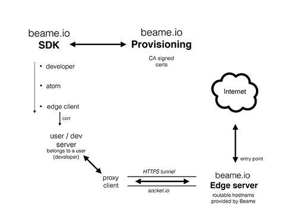

##### THIS IS ABOUT TO BE RELEASED. OR IT ALREADY IS. IF YOU ARE INTERESTED IN 
##### BEING ONE OF THE FIRST ONES TO USE THE SDK: CONTACT LISA@BEAME.IO

# What does Beame.io SDK do for you?

##  Beame.io SDK provides you with easy-to-use tools to receive and use x509 (aka SSL/TLS) certificates

The certificates are signed by a publicly trusted CA, similar to any other site that uses HTTPS.
You get:

1. A hostname (*Common Name* in the certificate) that is under Beame's domain.
2. A matching certificate.
3. A pair of keys of course

Beame.io *provisioning* handles ... the provisioning of certificates.
These certificates can be used for HTTPS on your server or any other relevant purpose, such as authentication and encryption.

## Beame.io provides you with a tunnelling service

Our tunnel servers (the *edge servers*) allow routing of traffic to your servers even when your servers don't have a routable IPs.

## Getting Started The Easy Way 

1. run npm install -g beame-sdk
2. Go to https://registration.beameio.net/ with a regular web browser.
2. Put in your name and email, and wait for a confirmation email. 
3. In the confirmation email, you should see a command that looks like this, run it, 
 	`beame creds createDeveloper --developerFqdn nc6qd6e6w0vd8hw5.v1.beameio.net --uid XXXXX-5a45-4165-a3cb-fb4060e46671`  
	
## Beame.io network diagram

Please note, that this diagram, was designed to show how the service works. Important to understand, that beame SSL proxies are transparent, data passes thru them without being touched. 



[See larger network diagram](readme-net-diag-large.png)

## Steps to use Beame.io SDK

At the end of each of the following steps you will be provided with a hostname under Beame's domain and a matching publicly trusted x509 certificate. The keys for the certificates are generated and stored locally on your computer. The keys do not leave your computer (unless you intentionally export them).

1. Register as a *developer*
1. Create an *atom* (an application) under the *developer*
1. Create an *edge client* (a user server) under the *atom*

At this point you can proceed with any of the following actions:

* Run a server (aka *edge client*) with a publicly trusted x509 certificate
* Sign arbitrary data with any of your certificates
* Check signatures of arbitrary data
* Encrypt arbitrary data so that only a specified entity can decrypt it
* Decrypt arbitrary data, that was sent to one of the entities you own (encrypted with one of your public keys)

# Beame.io SDK

# Installing Beame.io SDK

	npm install -g beame-sdk

Bash completion is available, run `beame` to see instructions.

## If current shell version does not support auto completion, please follow instructions below (mostly relevant for MacOS):
First ensure, that your bash version is 4.3 or higher. If not - upgrade it.

    sudo bash -c 'echo /usr/local/bin/bash >> /etc/shells'
Change to the new shell
    chsh -s /usr/local/bin/bash 

Next run in terminal:

    brew tap homebrew/versions
    brew rm bash-completion
    brew install bash-completion2

Add following instructions to your .bashrc file:

    if [ -f $(brew --prefix)/share/bash-completion/bash_completion ]; then
        . $(brew --prefix)/share/bash-completion/bash_completion
    fi

    source /usr/local/lib/node_modules/beame-sdk/src/cli/completion.sh

## Beame.io SDK environment variables

* `BEAME_DIR` (defaults to `~/.beame`) - Beame.io SDK data directory - all created credentials

## Beame.io SDK data directory

The structure of the Beame data folder is an implementation detail. You should not work with it directly. Use provided APIs or CLI to store and retrieve the data.

## Beame.io CLI

If you have completed the "Getting Started The Easy Way" above, you can feel free to use all what's described below
At any moment, using beame-sdk, you can see all credentials you currently own, by running:
	`beame creds show`

### Beame.io CLI - credentials

The following commands are used for acquiring and manipulating certificates.

* `beame creds list [--type {developer|atom|edgeclient}] [--fqdn fqdn] [--format {text|json}]` - list certificates
* `beame creds show [--type {developer|atom|edgeclient}] [--fqdn fqdn] [--format {text|json}]` - show certificate details
* `beame creds createAtom --developerFqdn developerFqdn --atomName atomName [--format {text|json}]` - create *atom* entity under current *developer*
* `beame creds createEdgeClient --atomFqdn atomFqdn [--format {text|json}]` - create *edge client* entity under the given *atom*
* `beame creds renew [--type {developer|atom|edgeclient}] [--fqdn fqdn]`
* `beame creds purge [--type {developer|atom|edgeclient}] [--fqdn fqdn]`

### Beame.io CLI - running test server

* `beame servers HttpsServerTestStart --edgeClientFqdn edgeClientFqdn` - run a HTTPS server for the specified hostname

### Beame.io CLI - encryption

* `beame crypto encrypt [--data data] [--fqdn fqdn]` - encrypts the given data so that only the owner of the specified entity can decrypt it
* `beame crypto decrypt [--fqdn fqdn] [--data data]` - decrypts the given data. You must be the owner of the given entity
* `beame crypto sign [--data data] [--fqdn fqdn]` - signes the given data as the specified entity
* `beame crypto checkSignature [--fqdn fqdn] [--data data] --signature signature` - verifies the correctness of the signature

##############################################################################
#                            Beame.io NodeJS API                           

###The idea behind the node.js sdk APIs is that you can employ Beame.io CLI functionality in your own node js project. 
###Receive publicly trusted cert with pseudo-random routable hostname and run your new SSL server in the same flow (or later, whenever you see it fit).

Provided APIs should be used after you have performed first two steps described above:
global npm install beame-sdk and email based developer creation.

Exported nodeJS APIs allow creation of 2 levels of credentials:
- atom - application under developer
- edgeClient - host under atom, intended to be exposed to the outer world

Current SDK release indends extensive CLI usage (see description above). So nodeJS APIs provide high level of access.  
Be aware, that API on each level require credentials created on previous/higher level:  
To use any API from beame-sdk include

    `var beameSDK = require ("beame-sdk");`

##   atom level commands
###  Requires developer credentials (developer fqdn/hostname) + appName (your application name)
###  To create new atom under current developer:
```
    beameSDK.creds.createAtom(devHostname,appName, amount, function(data){//amount - number of atoms to create
        //atom level hostname returned in: <data.hostname>
    });
```
##   edgeClient level commands
###  Requires atom credentials (atom fqdn/hostname). appHostName - atom level hostname created in previous step
###  To create new edgeClient under current atom:
```
    beameSDK.creds.createEdgeClient(atomHostname, amount, function(data){//amount - number of edgeClient to create
        //edge level hostname returned in: <data.hostname>
    });
```
###Beame-sdk provides example https server, that allows beame client to build and run fully functional https server with express support and with credentials created in steps described above

Export environment variable 'BEAME_PROJ_YOURPROJECTNAME' with value of edge-client-hostname (edgeClientFqdn)
In your server main.js create your server with following command:
```
    	var BeameServer = beameSDK.BaseHttpsServer.SampleBeameServer(host, PROJECT_NAME, appExpress,
        function (data, app) {
            //your code
        });
```
### Input parameters:
*`host` - edge hostName (pass <null> if you use environment variable - see below)
*`PROJECT_NAME` - name of environment variable that contains edgeClient hostname (pass <null> if you provided full hostname in first parameter)
*`appExpress` - express object. If you don't need express in your pplication, pass <null>
*`function(data,app){}` - callback, returned app - created http object

# Copy-paste example of https server with express support 
## Steps to take before you run below code:
Register as developeri in: `https://registration.beameio.net/`  
Upon receiving confirmation e-mail, copy-paste-run a command provided in e-mail body
should look like:  
`beame creds createDeveloper --developerFqdn nc6qd6e6w0vd8hw5.v1.beameio.net --uid XXXXX-5a45-4165-a3cb-fb4060e46671` 
Create web page with you preferred software (like Keynote -> export HTML on Mac)  
Store your new web page in `public` folder in directory of your future web server.  
In same location install `npm install beame-sdk`  
Create index.js and copy-paste into it code below  
Run it with `node index.js`  
In console output you will see something like:  
`{ Hostname: 'h3a6ipg1jz95x35n.v1.r.p.edge.eu-central-1b-1.v1.p.beameio.net' }`  
Go to web brower and direct it to your new secure web server by adding `https://` to the Hostname from console output  
That's that. You have your own https server running on your local machine, available from allover the world :)
```
"use strict";
var beameSDK = require ("beame-sdk");
var express = require('express');
var devHostname = "put-here-developer-name-you-got-from-creating-developer";
var appName = "BeameTestServer16";
var appExpress = express();
var edgeHostname;
appExpress.use(express.static(__dirname + '/public'));

var runTestBeameServer = function(){
    beameSDK.BaseHttpsServer.SampleBeameServer(edgeHostname, null, appExpress, function (data, app) {
        console.log('Server started on: '+edgeHostname);
        appExpress.get('/', function(req, res) {
            res.sendFile(path.join(__dirname + '/index.html'));
        });
            // process http events here with <app> if needed
    });
};

beameSDK.creds.createAtom(devHostname,appName, 1, function(data){
    {
		console.log('Just created atom with host:'+data.hostname);
        beameSDK.creds.createEdgeClient(data.hostname, 1, function(edgeData){
            {
                edgeHostname = edgeData.hostname;
				console.log('Congrats! My new hostname is: '+ edgeHostname);
                setTimeout(runTestBeameServer, 2000);//JIC - wait dns to update
            }
        });
    }
});
```
